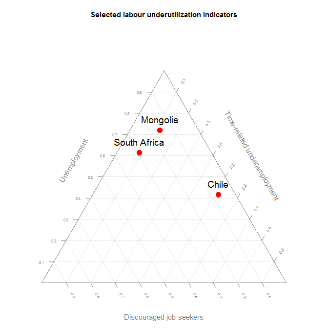
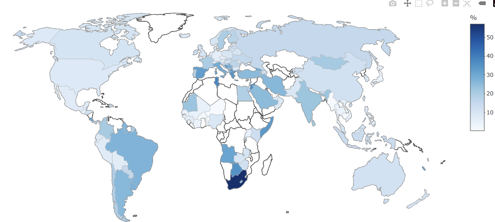

# Accessing ILOSTAT Data with Rilostat

## The ilostat R package in a few words

This R package provides tools to access, download and work with the data
contained in [ILOSTAT](https://ilostat.ilo.org), the ILO Department of
Statistics’ online database. ILOSTAT’s data and related metadata are
also directly available through ILOSTAT’s website.

For more information on ILOSTAT’s R package, including contact details
and source code, refer to its [github
page](https://github.com/ilostat/Rilostat).

## Introduction

The [ILO](https://www.ilo.org)’s main online database,
[ILOSTAT](https://ilostat.ilo.org), maintained by the Department of
Statistics, is the world’s largest repository of labour market
statistics. It covers all countries and regions and a wide range of
labour-related topics, including employment, unemployment, wages,
working time and labour productivity, to name a few. It includes time
series going back as far as 1938; annual, quarterly and monthly labour
statistics; country-level, regional and global estimates; and even
projections of the main labour market indicators.

ILOSTAT’s website provides immediate access to all its data and related
metadata through different ways. Basic users can simply view the desired
data online or download it in Excel or csv formats. More advanced users
can take advantage of ILOSTAT’s well-structured [bulk download
facility](https://ilostat.ilo.org/data/bulk/).

The ilostat R package (`'Rilostat'`) was designed to give data users the
ability to access the ILOSTAT database, search for data, rearrange the
information as needed, download it in the desired format, and make
various data visualizations, all in a programmatic and replicable
manner, with the possibility of quickly re-running the queries as
required.

##### Main features of the ilostat R package

- Provides access to all annual, quarterly, and monthly data available
  via the ILOSTAT [bulk download
  facility](https://ilostat.ilo.org/data/bulk/)

- Allows to search for and download data and related metadata in
  English, French and Spanish

- Gives the ability to return `POSIXct` dates for easy integration into
  plotting and time-series analysis techniques

- Returns data in long format for direct integration with packages like
  `ggplot2` and `dplyr`

- Gives immediate access to the most recent updates

- Allows for `grep`-style searching for data descriptions and names

##### Acknowledgements

The developer of this package drew extensive inspiration from the
[eurostat R package](https://CRAN.R-project.org/package=eurostat) and
its related documentation:

- [Retrieval and Analysis of Eurostat Open Data with the eurostat
  Package](https://journal.r-project.org/articles/RJ-2017-019/RJ-2017-019.pdf) -
  [Leo Lahti](https://github.com/antagomir), [Przemyslaw
  Biecek](https://github.com/pbiecek), [Markus
  Kainu](https://github.com/muuankarski) and [Janne
  Huovari](https://github.com/jhuovari). R Journal 9(1), 385-392, 2017.

## Installation

To install the release version, use the following command:

    ## Warning in library(package, lib.loc = lib.loc, character.only = TRUE,
    ## logical.return = TRUE, : there is no package called 'devtools'

``` r
install.packages("Rilostat")
```

To install the development version, use the following command:

``` r
if(!require(devtools)){install.packages('devtools')}
install_github("ilostat/Rilostat")
```

We do not expect to update the ilostat R package too often, but based on
questions and remarks from ILOSTAT data users, we will progressively
create more examples, tutorials, demos and apps. Please visit the
[Rilostat package website](https://ilostat.github.io/Rilostat/).

## Search for data

Unless you already know the code of the indicator or the ref_area
(reference area - countries or regions) that you want to download, the
first step would be to search for the data you are interested in.
[`get_ilostat_toc()`](https://ilostat.github.io/Rilostat/reference/get_ilostat_toc.md)
provides grep style searching of all available indicators from ILOSTAT’s
bulk download facility and returns the indicators matching your query.
`get_ilostat_toc(segment = 'ref_area')` returns the datasets available
by ref_area (‘country’ and ‘region’).

To access the table of contents of all available indicators in ILOSTAT
(by indicator):

``` r
toc <- get_ilostat_toc( quiet = TRUE)
```

  

| id                    | indicator           | indicator.label                                                                                                    | freq | freq.label |
|:----------------------|:--------------------|:-------------------------------------------------------------------------------------------------------------------|:-----|:-----------|
| SDG_0111_SEX_AGE_RT_A | SDG_0111_SEX_AGE_RT | SDG indicator 1.1.1 - Working poverty rate by sex and age (percentage of employed living below US\$3 PPP) (%)      | A    | Annual     |
| SDG_0131_SEX_SOC_RT_A | SDG_0131_SEX_SOC_RT | SDG indicator 1.3.1 - Proportion of population covered by social protection floors/systems by sex and function (%) | A    | Annual     |
| SDG_0552_NOC_RT_A     | SDG_0552_NOC_RT     | SDG indicator 5.5.2 - Proportion of women in senior and middle management positions (%)                            | A    | Annual     |

Table 1a. Extract, ‘Table of contents by indicator in English’

  

All settings are available in the 3 official languages of the ILO:
English (`'en'`), French (`'fr'`) and Spanish (`'es'`). The default is
`'en'`.

For instance, to access the table of contents of all available datasets
by reference area in ILOSTAT in Spanish:

  

``` r
toc <- get_ilostat_toc(segment = 'ref_area', lang = 'es', quiet = TRUE)
```

  

| id    | ref_area | ref_area.label | freq | freq.label | data.start | data.end | last.update         | n.records |
|:------|:---------|:---------------|:-----|:-----------|-----------:|---------:|:--------------------|----------:|
| AFG_A | AFG      | Afganistán     | A    | Anual      |       1977 |     2030 | 10/04/2026 10:03:27 |    359161 |
| AFG_Q | AFG      | Afganistán     | Q    | Trimestral |       2005 |     2024 | 05/03/2026 16:35:54 |      2903 |
| AFG_M | AFG      | Afganistán     | M    | Mensual    |       1976 |     2025 | 13/02/2026 12:22:29 |      9179 |

Table 1b. Extract, ‘Table of contents by ref_area in Spanish’

You can search for words or expressions within the table of contents
listing all of ILOSTAT’s indicators.

For example, searching for the word “bargaining” will return the
indicators containing that word somewhere in the indicator information:

``` r
toc <- get_ilostat_toc(search = 'bargaining', quiet = TRUE)
```

  

| id                | indicator       | indicator.label                                                                                                          | freq | freq.label | rep_var     | rep_var.label                                      | classification |
|:------------------|:----------------|:-------------------------------------------------------------------------------------------------------------------------|:-----|:-----------|:------------|:---------------------------------------------------|:---------------|
| SDG_0882_NOC_RT_A | SDG_0882_NOC_RT | SDG indicator 8.8.2 - Level of national compliance with labour rights (freedom of association and collective bargaining) | A    | Annual     | SDG_0882_RT | National compliance with labour rights (SDG 8.8.2) | NA             |
| ILR_CBCT_NOC_RT_A | ILR_CBCT_NOC_RT | Collective bargaining coverage rate (%)                                                                                  | A    | Annual     | ILR_CBCT_RT | Collective bargaining coverage rate                | NA             |

Table 1c. ‘Table of contents by indicator with search word ’bargaining’’

Similarly, you can also search the list of all available datasets by
reference area for a given reference area (using a country or region
name or code) or even for a given data frequency (annual, quarterly or
monthly). The search also allows you to look for several alternative
and/or additional items at once.

For instance, to look for datasets with annual data for either Albania
or France:

``` r
toc <- get_ilostat_toc(segment = 'ref_area', search = c('France|Albania', 'Annual'), 
                                            fixed = FALSE, quiet = TRUE)
```

  

| id    | ref_area | ref_area.label | freq | freq.label | data.start | data.end | last.update         | n.records |
|:------|:---------|:---------------|:-----|:-----------|-----------:|---------:|:--------------------|----------:|
| ALB_A | ALB      | Albania        | A    | Annual     |       1960 |     2030 | 20/04/2026 17:17:11 |   1264141 |
| FRA_A | FRA      | France         | A    | Annual     |       1955 |     2030 | 20/04/2026 17:16:08 |   2577142 |

Table 1d. ‘Table of contents by ref_area with search words ’France’ or
‘Albania’ and ‘Annual’’

You can also manipulate ILOSTAT’s table of contents’ dataframe using the
basic R filter. If you are already familiar with ILOSTAT data and the
way it is structured, you can easily filter what you want.

For example, if you know beforehand you want data only from ILOSTAT’s
Short Term Indicators dataset (code “STI”) and you are only interested
in monthly data (code “M”) you can simply do:

``` r
toc <-  dplyr::filter(get_ilostat_toc(), freq == 'M', quiet = TRUE)
```

  

| id                        | indicator               | indicator.label                                                         | freq | freq.label |
|:--------------------------|:------------------------|:------------------------------------------------------------------------|:-----|:-----------|
| POP_XWAP_SEX_AGE_NB_M     | POP_XWAP_SEX_AGE_NB     | Working-age population by sex and age (thousands)                       | M    | Monthly    |
| POP_XWAP_SEX_AGE_EDU_NB_M | POP_XWAP_SEX_AGE_EDU_NB | Working-age population by sex, age and education (thousands)            | M    | Monthly    |
| POP_XWAP_SEX_AGE_GEO_NB_M | POP_XWAP_SEX_AGE_GEO_NB | Working-age population by sex, age and rural / urban areas (thousands)  | M    | Monthly    |
| POP_XWAP_SEX_AGE_LMS_NB_M | POP_XWAP_SEX_AGE_LMS_NB | Working-age population by sex, age and labour market status (thousands) | M    | Monthly    |
| POP_XWAP_SEX_EDU_NB_M     | POP_XWAP_SEX_EDU_NB     | Working-age population by sex and education (thousands)                 | M    | Monthly    |

Table 1e. Extract, ‘Table of contents by indicator filtered for Monthly
Short term indicators’

## Download data

The function
[`get_ilostat()`](https://ilostat.github.io/Rilostat/reference/get_ilostat.md)
explores ILOSTAT’s datasets and returns datasets by indicator (default,
segment `indicator`) or by reference area (segment `ref_area`). The id
of each dataset is made up by the code of the segment chosen (indicator
code or reference area code) and the code of the data frequency required
(annual, quarterly or monthly), joined by an underscore.

##### Get a single dataset:

As stated above, you can easily access the single dataset of your choice
through the
[`get_ilostat()`](https://ilostat.github.io/Rilostat/reference/get_ilostat.md)
function, by indicating the code of the dataset desired
(indicator_frequency or ref_area_frequency).

If you want to access annual data for indicator code
UNE_2UNE_SEX_AGE_NB, you should type:

``` r
dat <- get_ilostat(id = 'UNE_2UNE_SEX_AGE_NB_A', segment = 'indicator', quiet = TRUE) 
```

  

| ref_area | source  | indicator           | sex   | classif1            | time | obs_value |
|:---------|:--------|:--------------------|:------|:--------------------|:-----|----------:|
| AFG      | XA:2198 | UNE_2UNE_SEX_AGE_NB | SEX_T | AGE_YTHADULT_YGE15  | 2027 |  1308.510 |
| AFG      | XA:2198 | UNE_2UNE_SEX_AGE_NB | SEX_T | AGE_YTHADULT_Y15-24 | 2027 |   582.364 |
| AFG      | XA:2198 | UNE_2UNE_SEX_AGE_NB | SEX_T | AGE_YTHADULT_YGE25  | 2027 |   726.145 |

Table 2a. Extract, ‘Annual unemployment by sex and age, ILO modelled
estimates, Nov. 2018’

If you want to access all annual data available in ILOSTAT for Armenia:

``` r
dat <- get_ilostat(id = 'ARM_A', segment = 'ref_area', quiet = TRUE) 
```

  

| ref_area | source  | indicator           | sex   | classif1           | time | obs_value |
|:---------|:--------|:--------------------|:------|:-------------------|:-----|----------:|
| ARM      | XA:1931 | SDG_0111_SEX_AGE_RT | SEX_T | AGE_YTHADULT_YGE15 | 2025 |     0.047 |
| ARM      | XA:1931 | SDG_0111_SEX_AGE_RT | SEX_T | AGE_YTHADULT_YGE15 | 2024 |     0.212 |
| ARM      | XA:1931 | SDG_0111_SEX_AGE_RT | SEX_T | AGE_YTHADULT_YGE15 | 2023 |     1.084 |

Table 2b. Extract, ‘Armenia, annual data’

  

##### Get multiple datasets:

It is also possible to download multiple datasets at once, simply by
setting the dataset’s id as a vector of ids or a tibble that lists ids
in a specific column:

``` r
dat <- get_ilostat(id = c('AFG_A', 'TTO_A'), segment = 'ref_area',quiet = TRUE)

dplyr::count(dat, ref_area)
```

    ## # A tibble: 2 × 2
    ##   ref_area      n
    ##   <chr>     <int>
    ## 1 AFG      359161
    ## 2 TTO      372668

  

``` r
toc <- get_ilostat_toc(search = 'CPI_', quiet = TRUE)

dat <- get_ilostat(id = toc, segment = 'indicator', quiet = TRUE) 

dplyr::count(dat, indicator)
```

    ## # A tibble: 6 × 2
    ##   indicator            n
    ##   <chr>            <int>
    ## 1 CPI_ACPI_COI_RT 144980
    ## 2 CPI_MCPI_COI_RT 138608
    ## 3 CPI_NCPD_COI_RT 664657
    ## 4 CPI_NCYR_COI_RT 758098
    ## 5 CPI_NWGT_COI_RT  41256
    ## 6 CPI_XCPI_COI_RT 794629

## Time format

The function
[`get_ilostat()`](https://ilostat.github.io/Rilostat/reference/get_ilostat.md)
will return time period information by default in a raw time format
(`time_format = 'raw'`), which is a character vector with the following
syntax:

- Yearly data: `'YYYY'` where YYYY is the year.

- Quarterly data: `'YYYYqQ'` where YYYY is the year and Q is the quarter
  (the number corresponding to the quarter from 1 to 4).

- Monthly data: `'YYYYmMM'` where YYYY is the year and MM is the month
  (the number corresponding to the month from 01 to 12).

To ease the use of data for plotting or time-series analysis techniques,
the function can also return POSIXct dates (using
`time_format = 'date'`) or numeric dates (using `time_format = 'num'`).

For instance, the following will return quarterly unemployment data by
sex and age, with the time dimension in numeric format:

``` r
dat <- get_ilostat(id = 'UNE_TUNE_SEX_AGE_NB_Q', time_format = 'num', quiet = TRUE) 
```

  

| ref_area | source   | indicator           | sex   | classif1            |    time | obs_value |
|:---------|:---------|:--------------------|:------|:--------------------|--------:|----------:|
| AGO      | BA:13951 | UNE_TUNE_SEX_AGE_NB | SEX_T | AGE_YTHADULT_YGE15  | 2025.25 |  1587.134 |
| AGO      | BA:13951 | UNE_TUNE_SEX_AGE_NB | SEX_T | AGE_YTHADULT_Y15-64 | 2025.25 |  1578.551 |
| AGO      | BA:13951 | UNE_TUNE_SEX_AGE_NB | SEX_T | AGE_YTHADULT_Y15-24 | 2025.25 |   707.463 |

Table 3a. Extract, ‘Quarterly unemployment by sex and age’

  

| ref_area | source   | indicator           | sex   | classif1            |    time | obs_value |
|:---------|:---------|:--------------------|:------|:--------------------|--------:|----------:|
| AGO      | BA:13951 | UNE_TUNE_SEX_AGE_NB | SEX_T | AGE_YTHADULT_YGE15  | 2025.25 |  1587.134 |
| AGO      | BA:13951 | UNE_TUNE_SEX_AGE_NB | SEX_T | AGE_YTHADULT_Y15-64 | 2025.25 |  1578.551 |
| AGO      | BA:13951 | UNE_TUNE_SEX_AGE_NB | SEX_T | AGE_YTHADULT_Y15-24 | 2025.25 |   707.463 |

Table 3b. Extract, Monthly time-related underemployment by sex and age

## Cached data

The function
[`get_ilostat()`](https://ilostat.github.io/Rilostat/reference/get_ilostat.md)
stores cached data by default at `file.path(tempdir(), "ilostat")` in
`rds` binary format.

However, via the `cache_dir` arguments, it is also possible to choose a
different work directory to store data in, and via the `cache_format`
arguments you can save it in other formats, such as `csv`, `dta`, `sav`,
and `sas7bdat`.

``` r
dat <- get_ilostat(id = 'TRU_TTRU_SEX_AGE_NB_M', cache_dir = 'c:/temp', cache_format = 'dta', quiet = TRUE) 
```

These arguments can also be set using
`options(ilostat_cache_dir = 'C:/temp')` and
`options(ilostat_cache_format = 'dta')`.

The name of the cache file is built using
`paste0(segment, "-", id, "-", type,"-",time_format, "-", last_toc_update ,paste0(".", cache_format))`,
with ‘last_toc_update’ being the latest update of the dataset from the
table of contents.

With the argument `back = FALSE`, datasets are downloaded and cached
without being returned in R. This quiet setting is convenient
particularly when downloading large amounts of data or datasets.

``` r
get_ilostat(id = get_ilostat_toc(search = 'SDG'),   cache_dir = 'c:/temp', cache_format = 'dta', 
                                                    back = FALSE, quiet = TRUE)
```

## Filter data

Once you have retrieved and/or cached the dataset(s) you need, advanced
`filters` can help you refine your data selection and facilitate
reproducible analysis. You can apply several different filters to your
datasets, to filter the data by reference area, sex, classification
item, etc.

``` r
options(ilostat_cache_dir = 'C:/temp')
dat <- get_ilostat(id = 'UNE_DEAP_SEX_AGE_RT_A', filters = list(
                                                    ref_area = c('BRA', 'ZAF'), 
                                                    sex = 'T', 
                                                    classif1 = '_Y15-24'), quiet = TRUE)
dplyr::count(dat, ref_area, sex, classif1)
```

    ## # A tibble: 6 × 4
    ##   ref_area sex   classif1                 n
    ##   <chr>    <chr> <chr>                <int>
    ## 1 BRA      SEX_T AGE_10YRBANDS_Y15-24    32
    ## 2 BRA      SEX_T AGE_AGGREGATE_Y15-24    32
    ## 3 BRA      SEX_T AGE_YTHADULT_Y15-24     37
    ## 4 ZAF      SEX_T AGE_10YRBANDS_Y15-24    25
    ## 5 ZAF      SEX_T AGE_AGGREGATE_Y15-24    25
    ## 6 ZAF      SEX_T AGE_YTHADULT_Y15-24     25

  

``` r
options(ilostat_cache_dir = 'C:/temp')
dat <- get_ilostat(id = 'UNE_DEAP_SEX_AGE_RT_A', filters = list(
                                                    ref_area = c('BRA', 'ZAF'), 
                                                    sex = 'M', 
                                                    classif1 = '_YGE15'), 
                                                    quiet = TRUE)
```

  

| ref_area | source  | indicator           | sex   | classif1             | time | obs_value | obs_status | note_classif | note_indicator | note_source |
|:---------|:--------|:--------------------|:------|:---------------------|:-----|----------:|:-----------|:-------------|:---------------|:------------|
| BRA      | BX:6355 | UNE_DEAP_SEX_AGE_RT | SEX_T | AGE_YTHADULT_Y15-24  | 2025 |    13.594 | NA         | NA           | NA             | R1:3513     |
| BRA      | BX:6355 | UNE_DEAP_SEX_AGE_RT | SEX_T | AGE_AGGREGATE_Y15-24 | 2025 |    13.594 | NA         | NA           | NA             | R1:3513     |

Table 4a. Extract, Youth male unemployment rate in Brazil and South
Africa (ILO modelled estimates, Nov. 2018), ‘Series Key’

  

``` r
# options(ilostat_cache_dir = 'C:/temp')
dat <- get_ilostat(id = 'UNE_DEAP_SEX_AGE_RT_A', filters = list(
                                                    ref_area = c('BRA', 'ZAF'), 
                                                    sex = 'F', 
                                                    classif1 = '_YGE15'), 
                                                 quiet = TRUE)
```

  

| ref_area | source  | indicator           | sex   | classif1            | time | obs_value |
|:---------|:--------|:--------------------|:------|:--------------------|:-----|----------:|
| BRA      | BX:6355 | UNE_DEAP_SEX_AGE_RT | SEX_F | AGE_YTHADULT_YGE15  | 2025 |     7.155 |
| BRA      | BX:6355 | UNE_DEAP_SEX_AGE_RT | SEX_F | AGE_AGGREGATE_YGE15 | 2025 |     7.155 |
| BRA      | BX:6355 | UNE_DEAP_SEX_AGE_RT | SEX_F | AGE_10YRBANDS_YGE15 | 2025 |     7.155 |

Table 4b. Extract, Youth female unemployment rate in Brazil and South
Africa (ILO modelled estimates, Nov. 2018)

In order to delete files from the cache just run:

``` r
clean_ilostat_cache()
```

## Plot data

> Now that you found the datasets you needed and filtered them to have
> the desired data, you can start manipulating ILOSTAT data in a
> reproducible manner, and even use your other favourite R packages to
> make some great data visualizations.

For example, you can use `ggplot2` and `dplyr` to visually compare
trends in male labour force participation rate in Germany, France and
the United States, since 2005 (see below). This lineal graph allows us
to see that the male labour force participation rate is considerably
higher in the United States than in Germany and France, but it has been
decreasing at a steady pace since around 2008, closing the gap in
participation rates particularly with Germany, where the male labour
force participation rate slightly increased in the last period observed.

``` r
require(Rilostat)
require(ggplot2, quiet = TRUE)
require(dplyr, quiet = TRUE)

  get_ilostat(id = 'EAP_DWAP_SEX_AGE_RT_A', 
              time_format = 'num', 
              filters = list( ref_area = c('FRA', 'USA', 'DEU'), 
                              sex = 'SEX_M',
                              classif1 = '_YGE15',
                              timefrom = 2005, timeto = 2019), quiet = TRUE)  %>% 
  distinct(ref_area, time, obs_value) %>% 
  ggplot(aes(x = time, y = obs_value, colour = ref_area)) + 
  geom_line() + 
  ggtitle('Male labour force participation rate in selected countries, 2005-2019') + 
  scale_x_continuous(breaks = seq(2005, 2017, 3)) +
  labs(x="Year", y="Male LFPR (%)", colour="Country:") +  
  theme(legend.position = "top", plot.title = element_text(hjust = 0.5))
```

  


Male labour force participation rate in selected countries, 2005-2019

  
  

> You can also build interesting (and visually telling) stacked columns
> or bars.

For example, based on ILOSTAT data, you can plot the distribution of
employed persons by economic class (defined according to the household’s
per capita income/consumption per day). You can even do it with several
disaggregations: in the example below, we chose to show the employment
distribution by economic class separately for men and women and for
youth and adults. From this figure, we clearly understand that working
poverty (being poor in spite of being employed) affects youth much more
than adults, and women more than men.

``` r
require(Rilostat)
if(!require(ggplot2)){install.packages('ggplot2')}
if(!require(dplyr)){install.packages('dplyr')}

    get_ilostat(id = 'EMP_2EMP_SEX_AGE_CLA_NB_A', 
                filters = list( ref_area = 'ZAF', 
                                time = '2019', 
                                sex = c('M', 'F'), 
                                classif1 = c('Y15-24', 'YGE25')), quiet = TRUE) %>% 
    group_by(ref_area, source , indicator , sex  , classif1, time) %>% 
    mutate(obs_value = obs_value / max(obs_value) * 100) %>% 
    ungroup %>%
    filter(!classif2 %in% c('CLA_ECOCLA_TOTAL', 'CLA_ECOCLA_USDGE3')) %>% 
    distinct(obs_value, sex, classif1, classif2) %>% 
    label_ilostat() %>% 
    
    ggplot(aes(y=obs_value, x=as.factor(classif1.label), fill=classif2.label)) +
    geom_bar(stat="identity") +
    facet_wrap(~as.factor(sex.label)) + coord_flip() +
    theme(legend.position="top") +
    ggtitle("Employment by economic class, sex and age, South Africa, 2019") +
    labs(x="Age group", y="Distribution of economic class (%)", fill="Economic class : ") + 
    theme(plot.title = element_text(hjust = 0.5)) + 
    scale_fill_brewer(type = "div")
```

  


Employment by economic class, sex and age, South Africa, 2019

  
  

> You can also combine the ilostat package with other packages to create
> triangular graphs, plotting three different indicators which relate to
> the same topic and whose observations are mutually exclusive.

You can use this type of graph, for instance, to visually convey the
share of the employed population working in agriculture, industry and
services, all three compared, and even more revealing, compare this
across countries.

In the example below, we used three different indicators of labour
underutilization (unemployment, time-related underemployment and
discouraged job-seekers) to study how they are inter-related in selected
countries. These three population groups are all mutually exclusive, but
they are all part of the broad category of labour underutilization.
Unemployment represents all persons not in employment, available for
employment and actively seeking employment, while discouraged
job-seekers are those persons not in employment and available for
employment who do not actively look for employment for specific reasons
having to do with the situation in the labour market, and time-related
underemployment refers to persons in employment who would like to work
more hours and are available to work more hours than their current
working time. The graph below brings to light the differences across
countries in the labour underutilization composition, by showing where
unemployment is the biggest concern, as opposed to time-related
underemployment or discouragement.

``` r
require(Rilostat)
if(!require(tidyr)){install.packages('tidyr')}
if(!require(dplyr)){install.packages('dplyr')}
if(!require(plotrix)){install.packages('plotrix')}
if(!require(stringr)){install.packages('stringr')}


triangle <- get_ilostat(
  id = c(
    "EIP_WDIS_SEX_AGE_NB_A",
    "UNE_TUNE_SEX_AGE_NB_A",
    "TRU_TTRU_SEX_AGE_NB_A"
  ),
  filters = list(
    ref_area = c("ZAF", "MNG", "CHL"),
    source = "BA",
    sex = "SEX_T",
    classif1 = "YGE15",
    time = "2013"
  ),
  quiet = TRUE
) %>%
  distinct(ref_area, indicator, obs_value) %>%   # replaces cmd
  label_ilostat() %>%
  group_by(ref_area.label) %>%
  mutate(obs_value = obs_value / sum(obs_value)) %>%
  ungroup() %>%
  mutate(
    indicator.label = str_replace(
      indicator.label,
      fixed(" by sex and age (thousands)"),
      ""
    )
  ) %>%
  pivot_wider(
    names_from = indicator.label,
    values_from = obs_value
  )

par(cex=0.75, mar=c(0,0,0,0))
positions <- plotrix::triax.plot(
                      as.matrix(triangle[, c(2,3,4)]),
                      show.grid = TRUE,
                      main = 'Selected labour underutilization indicators',
                      label.points= FALSE, point.labels = triangle$ref_area.label,
                      col.axis="gray50", col.grid="gray90",
                      pch = 19, cex.axis=1.2, cex.ticks=0.7, col="grey50")
                     
                     
ind <- which(triangle$ref_area.label %in%  triangle$ref_area.label)

df <- data.frame(positions$xypos, geo =  triangle$ref_area.label)

points(df$x[ind], df$y[ind], cex=2, col="red", pch=19)

text(df$x[ind], df$y[ind], df$geo[ind], adj = c(0.5,-1), cex=1.5) 
```

  



Different indicators of labour underutilization

  
  

> It is also possible to create maps showing how indicators behave
> across the world at a given point in time (static maps) or even
> through time (dynamic maps allowing the user to scroll over the
> available time period).

For instance, below we have built a map to see differences across the
world in the youth unemployment rate. For this, we have selected data
from a compilation which is methodologically robust and consistent
across countries to ensure international comparability: the ILO modelled
estimates (from November 2017). You can change the legend settings to
use the colour coding that best suits your data. In our case, the colour
scale used allows us to quickly see that youth unemployment rates are
particularly high in Southern and Northern Africa.

``` r
require(Rilostat)
if(!require(plotly)){install.packages('plotly')}
if(!require(dplyr)){install.packages('dplyr')}
if(!require(stringr)){install.packages('stringr')}

dat <- get_ilostat(id = 'UNE_DEAP_SEX_AGE_RT_A', filters = list(
                                time = '2019', 
                                sex = 'SEX_T', 
                                classif1 = '_Y15-24'
                                ), quiet = TRUE) %>% 
            distinct(ref_area, obs_value) %>% 
            left_join(  Rilostat:::ilostat_ref_area_mapping %>% 
                            select(ref_area, ref_area_plotly)%>% 
                            label_ilostat(code = 'ref_area'), 
                        by = "ref_area") %>% 
            filter(!obs_value %in% NA)

    
            
dat %>% 
    plot_geo( 
            z = ~obs_value, 
            text = ~ref_area.label, 
            locations = ~ref_area_plotly
        ) %>% 
        add_trace(
            colors = 'Blues',
            marker = list(
                        line = list(
                            color = toRGB("grey"), 
                            width = 0.5)
                    ), 
            showscale = TRUE
        ) %>%
        colorbar(
            title = '%', 
            len = 0.5
        ) %>%
        layout(
          geo = list(   
                    showframe = FALSE,  
                    showcoastlines = TRUE,
                    projection = list(type = 'natural earth'), 
                    showcountries = TRUE, 
                    resolution = 110) # or 50
            ) 
```

  



Youth unemployment rate in 2019

  
  

## Contact information

For further information on the `ilostat` R package, please contact:

- ILO Department of Statistics (`ilostat@ilo.org`)

For specific issues concerning code source, please report on
[github](https://github.com/ilostat/Rilostat/issues)

For questions related to the ilostat database contact
(`ilostat@ilo.org`) or visit [ilostat website](https://ilostat.ilo.org)

Permission to reproduce ILO publication and data: the reproduction of
ILO material is generally authorized for non-commercial purposes and
within established limits. However, you may need to submit a formal
request in certain circumstances. for more information please refer to:

<https://www.ilo.org/global/copyright>

<https://www.ilo.org/global/copyright/request-for-permission>
