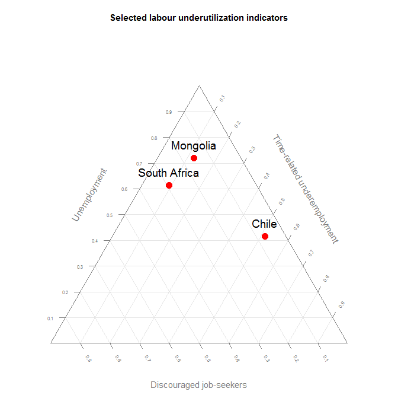

```{r setup, include=FALSE}
knitr::opts_chunk$set(
	echo = TRUE,
	message = FALSE,
	warning = FALSE
)
```

# World map of NEET

```{R, eval=FALSE}


library(Rilostat)
library(tidyverse)
library(plotly)

X <- get_ilostat(id = 'EIP_2EET_SEX_RT_A', segment = 'indicator', filters = list(time = '2018', sex='T')) %>% 
  filter(str_sub(ref_area,1,1) != 'X') %>%
  select(ref_area, obs_value) %>%
  left_join(Rilostat:::ilostat_ref_area_mapping %>%
              select(ref_area, ref_area_plotly) %>%
              label_ilostat(code = 'ref_area'),
            by = "ref_area") %>%
  filter(!obs_value %in% NA) %>%
  mutate(tot_obs_value = cut(obs_value, quantile(obs_value, na.rm = TRUE), include.lowest = TRUE))

X %>% 	plot_geo( width = 900, height = 600) %>%
		add_trace(
			z = ~obs_value, 
			color = ~obs_value, 
			colors=c("green", "blue"), 
			text = ~ref_area.label, 
			locations = ~ref_area_plotly, 
			marker = list(line = list(color = toRGB("grey"), width = 0.5)),
			showscale = TRUE) %>%
		colorbar(title = '(%)', len = 0.5, ticksuffix="%") %>%
		layout(
			title = list(	text = "Share of youth not in employment, education or training (NEET) in 2018",
							font = list(size = 18)),
			font = (size = 1),
			geo = list(	showframe = TRUE,
						showcoastlines = TRUE,
						projection = list(type = 'Mercator'),
						showCountries = TRUE,
						resolution = 110), 
			annotations = 
				list( 	x = 1, y = 1,
						text = "Source: ilostat", 
						showarrow = F, xref='paper', yref='paper', 
						xanchor='right', yanchor='auto', xshift=0, yshift=0,
						font=list(size=15, color="blue"))
		)
  

  
  
```
```{r, echo=FALSE, out.width = "100%"}

```


# Stacked area graph of Employment distribution by sector

```{R,out.width = "100%"}
#--------------
# Stacked area graph
# Data: Global employment distribution by occupation -- ILO modelled estimates, November 2018
#--------------

library(Rilostat)
library(tidyverse)
library(viridis)
library(hrbrthemes)
library(scales)
library(stringr)
library(officer)

# -- Relative distribution

dat_emp1 <- get_ilostat(id = 'EMP_2EMP_SEX_OCU_DT_A', 
                        segment = 'indicator', 
                        type = "both",
                        time_format = "num", 
                        filters = list(ref_area = 'X01', 
                                       sex = 'SEX_T')) %>% 
  filter(classif1 != 'OCU_DETAILS_TOTAL') %>%
  mutate(distribution = obs_value/100) %>%
  select(time, classif1, distribution) 

# Plot (With the relative distribution)

dat_emp1 %>% 
        ggplot( aes(x=time, 
                    y=distribution, 
                    fill=classif1, 
                    color=classif1, 
                    text=classif1)) +
  geom_area() +
  scale_fill_viridis(discrete = TRUE) +
  scale_color_viridis(discrete = TRUE) +
  labs(x="", y="")  +
  scale_y_continuous(breaks = pretty_breaks(n = 10), labels=percent, expand = c(0.01,0.01)) +
  scale_x_continuous(breaks = seq(1991, 2023, 2), lim = c(1991, 2023), expand = c(0.01,0.01)) +
  theme_ipsum() +
  theme(axis.text.x=element_text(size=8),
        axis.text.y=element_text(size=8), 
        legend.position="none") +
  annotate(	"text", 
			x=1992, 
			y= c(0.989, 0.95, 0.89, 0.83, 0.75, 0.40, 0.12, 0.04), 
			label =c(	"Managers", 
						"Professionals", 
						"Technicians and associate professionals", 
						"Clerical support workers", 
						"Service and sales workers", 
						"Craft and related trades workers", 
						"Plant and machine operators, and assemblers", 
						"Elementary occupations and skills agricultural, forestry and fishery workers"), 
					hjust = 0, size=I(3)) +
  annotate("rect", xmin = 2018, xmax = 2023, ymin = 0, ymax = 1, alpha = 0.3, fill = "gray") +
  annotate("text", label = "Projections", x=2019, y=0.9, vjust=1, hjust=0, size=I(4)) +
  geom_vline(xintercept = 2018, colour = "red") + 
  labs(caption = "Source: ilostat", 
       title = "Global employment distribution by occupation -- modelled estimates, Nov. 2018") + 
  theme(plot.title = element_text(size=12, face="bold.italic"))


```


# Box plot of Labour force participation

```{R}

#--------------
# BoxPlot
# Data: Labour force participation rate (5 points in time) by sex
#--------------

library(Rilostat)
library(tidyverse)
library(scales)

dat_emp4 <- get_ilostat(id = 'EAP_2WAP_SEX_AGE_RT_A', segment = 'indicator', filters = list(time = c('1990', '2000', '2010', '2018', '2030'), sex=c('F', 'M'), classif1='AGGREGATE_TOTAL')) %>% 
  filter(str_sub(ref_area,1,1) != 'X') %>%  
  mutate(sex_lab = ifelse(sex=='SEX_F', 'Women', ifelse(sex=='SEX_M', 'Men', NA))) %>%
  mutate(sex_year = ifelse((sex=='SEX_F' & time=='2030'), 'Women - Projection', ifelse((sex=='SEX_M' & time=='2030'), 'Men - Projection', ifelse((sex=='SEX_F' & time!='2030'), 'Women - Estimate', ifelse((sex=='SEX_M' & time!='2030'), 'Men - Estimate', NA))))) %>%
  mutate(lfpr = obs_value/100) %>%
  select(ref_area, sex_lab, sex_year, time, lfpr)%>%
  
  group_by(sex_year, time) %>%
  mutate(MD = median(lfpr)) %>%
  ungroup() %>%
  mutate(MD = as.character(MD))

ggplot(dat_emp4, aes(x=time, y=lfpr, fill=sex_year, alpha=sex_year)) +
  geom_boxplot() +
  facet_wrap(~sex_lab) +
  theme_bw() +
  theme (legend.position="none") +
  scale_alpha_manual(values=c(0.7,0.2, 0.7, 0.2)) +
  scale_fill_manual(values=c("yellow","yellow","turquoise4","turquoise4")) +
  labs( x="", 
        y="LFPR (%)",
        title = "Labour force participation rate by sex ILO modelled estimates, July 2018", 
        caption = "Source: ilostat") + 
  scale_y_continuous(labels=percent)

```


# Pyramid chart of Labour force distribution

```{r,out.width = "100%"}

 require(dplyr)
 require(tidyverse)
 require(plotrix)
 require(Rilostat)


 test_ref_area = 'FRA'
 test_time <- '2018'
 test_indicator <- c('EIP_2EIP_SEX_AGE_NB', 'EAP_2EAP_SEX_AGE_NB')
 test_age <- c("AGE_5YRBANDS_Y15-19", "AGE_5YRBANDS_Y20-24", "AGE_5YRBANDS_Y25-29", "AGE_5YRBANDS_Y30-34", "AGE_5YRBANDS_Y35-39", "AGE_5YRBANDS_Y40-44", "AGE_5YRBANDS_Y45-49", "AGE_5YRBANDS_Y50-54", "AGE_5YRBANDS_Y55-59", "AGE_5YRBANDS_Y60-64")
 test_sex <- c('SEX_M', 'SEX_F')
 test_source = 'ILO modelled estimates, May 2017'
 ref_area_name <- label_ilostat(test_ref_area, dic = 'ref_area')
 ref_age <- label_ilostat(test_age, dic = 'classif1') %>% str_split( pattern = ': ',simplify = TRUE) %>% .[,2]
 ref_sex <- label_ilostat(test_sex, dic = 'sex') %>% str_split( pattern = ': ',simplify = TRUE) %>% .[,2]
 color_code <- c("#3585E7","#F0D285")
 

 X 			<- 	get_ilostat(id = paste0(test_ref_area, '_A'), 
							segment = 	'ref_area', 
							filters = 	list(	indicator = test_indicator, 
											time = test_time, 
											ref_area = test_ref_area, 
											classif1 = test_age, 
											sex = test_sex),
							cache = FALSE) %>% 
					select(indicator, classif1, obs_value, sex) %>% 
					mutate(	classif1 = label_ilostat(classif1, dic = 'classif1') %>% str_split( pattern = ': ',simplify = TRUE) %>% .[,2], 
							sex = label_ilostat(sex, dic = 'sex') %>% str_split( pattern = ': ',simplify = TRUE) %>% .[,2]) %>% 
					spread(indicator, obs_value) %>% 
					select_(.dots = list("sex", "classif1", val1 = test_indicator[1], val2 = test_indicator[2] ))
					
					
					
 sideLeft	<- 	X %>% 
					filter(sex %in% ref_sex[1]) %>% 
					select(-sex,-classif1) %>% 
					select(val2, val1) %>% 
					mutate(	#val1 = val1 - val2, 
							TOT = val2 + val1, 
							STOT = TOT / sum(TOT) * 100, 
							SHval2 = val2 / TOT * STOT, 
							SHval1 = val1 / TOT * STOT) %>% 
					select(SHval2, SHval1) %>% as.matrix 
 sideright	<-	X %>% 
					 filter(sex %in% ref_sex[2])%>% 
					select(val2, val1) %>% 
					mutate(	# val1 = val1 - val2,
							TOT = val2 + val1, 
							STOT = TOT / sum(TOT) * 100, 
							SHval2 = val2 / TOT * STOT, 
							SHval1 = val1 / TOT * STOT) %>% 
					select(SHval2, SHval1) %>% as.matrix 
 Label	<-	X %>% distinct(classif1) %>% .$classif1 

 
 
 FirstPar	<- 	pyramid.plot(	
					lx = sideLeft,
					rx = sideright,
					labels = Label,
					unit = "%",
					lxcol = color_code,
					rxcol = color_code,
					laxlab = c(0, 5, 10),			# left side axes
					raxlab = c(0, 5, 10),			# right side axes
					top.labels = c("Male", "Age", "Female"),
					gap = 1.5 							# place for age labels
				) +
				mtext(	# give it a title
					text = paste0(ref_area_name , ", labour force distribution, ", test_time),
					side = 3,
					line = 2,
					cex=1.5) 

					
 # legend(	### stick in a legend
					# par('usr')[1],
					# par('usr')[4],
					# c("Labour force","Outside Labour force"),
					# fill = color_code, 
					# border = '#FFFFFF', 
					# bty  = 'n') 
			
 
 # par(	### don't forget to restore the margins and background
		# mar = FirstPar,
		# bg = "transparent") 


```


# Column chart of unemployment rate (vertical bars)

```{r,out.width = "100%"}

 require(tidyverse)
 require(plotly)
 require(Rilostat)
 
 ref_region <- c('World', 'Asia and the Pacific', 'Americas', 'Europe and Central Asia', 'Africa', 'Arab States')
 
 code_region <- get_ilostat_toc(segment = 'ref_area') %>% filter(ref_area.label %in% ref_region)
 
 X <-	get_ilostat(id = 'UNE_2EAP_SEX_AGE_RT_A', 
						filters = list(	ref_area  = code_region$ref_area, 
										sex = 'SEX_T', 
										classif1 = 'AGE_YTHADULT_YGE15', 
										time = '2017'), 
						cache = FALSE) %>% 
				mutate(ref_area.label = label_ilostat(ref_area, dic = 'ref_area') %>% factor(.,levels = ref_region))  %>% 
				arrange(obs_value) %>% 
				spread(sex, obs_value)
 
 
plot_ly(X, 
			x = ~ref_area.label, 
			y = ~SEX_T, 
			type = 'bar') %>%
 layout(
		 title = list(	text  = "Global and regional unemployment rates, 2017", 
						font = list(size = 18)),
         xaxis = list(	title = "", 
						tickfont = list(size = 18)
						),
         yaxis = list(	title = "Percentage", 
						titlefont = list(size = 18),
						tickfont = list(size = 18)
						),
		annotations = 
				list( 	# x = 1.18, y = - 0.058,
						x = 1 , y = 1,
						text = "Source: ilostat", 
						showarrow = F, xref='paper', yref='paper', 
						xanchor='right', yanchor='auto', xshift=0, yshift=0,
						font=list(size=15, color="blue"))
		)
  
  
  
```


# Time series of Labour force participation rate

```{r, eval=FALSE}
require(Rilostat)
require(ggplot2, quiet = TRUE)
require(dplyr, quiet = TRUE)

  get_ilostat(id = 'EAP_DWAM_NOC_RT_A', 
              time_format = 'num', 
              filters = list( ref_area = c('FRA', 'USA', 'DEU'), 
                              timefrom = 2005, timeto = 2017))  %>% 
  select(ref_area, time, obs_value) %>% 
  ggplot(aes(x = time, y = obs_value, colour = ref_area)) + 
  geom_line() + 
  ggtitle('Male labour force participation rate in selected countries, 2005-2017') + 
  scale_x_continuous(breaks = seq(2005, 2017, 3)) +
  labs(x="Year", y="Male LFPR (%)", colour="Country:") +  
  theme(legend.position = "top", plot.title = element_text(hjust = 0.5))


```

```{r, echo=FALSE, out.width = "100%"}
knitr::include_graphics("./g1_ts.png")
```


# Column chart of unemployment rate (vertical bars)

```{r,out.width = "100%"}


 require(tidyverse)
 require(plotly)
 require(Rilostat)
 
 ref_region <- c('World', 'Asia and the Pacific', 'Americas', 'Europe and Central Asia', 'Africa', 'Arab States')
 
 code_region <- get_ilostat_toc(segment = 'ref_area') %>% filter(ref_area.label %in% ref_region)
 
 X <-	get_ilostat(id = 'UNE_2EAP_SEX_AGE_RT_A', 
						filters = list(	ref_area  = code_region$ref_area, 
										sex = c('SEX_M', 'SEX_F'), 
										classif1 = 'AGE_YTHADULT_YGE15', 
										time = '2017'), 
						cache = FALSE) %>% 
				mutate(ref_area.label = label_ilostat(ref_area, dic = 'ref_area') %>% factor(.,levels = ref_region))  %>% 
				arrange(obs_value) %>% 
				spread(sex, obs_value)
 
 
 plot_ly(	data = X , 
			x = ~ref_area.label, 
			y = ~SEX_M, 
			type = 'bar', 
			name = 'Male') %>%
 add_trace(	y = ~SEX_F, 
			name = 'Female') %>%
 layout(	title = list( text = "Global and regional unemployment rates by sex, 2017"),
			xaxis = list(	title = "", 
						tickfont = list(size = 12)
						),
			yaxis = list(	title = "Percentage", 
						titlefont = list(size = 12),
						tickfont = list(size = 12)
						), 
			barmode = 'group',
		annotations = 
				list( 	x = 0.1, y = -0.07,
						text = "Source: ilostat", 
						showarrow = F, xref='paper', yref='paper', 
						xanchor='right', yanchor='auto', xshift=0, yshift=0,
						font=list(size=15, color="blue"))
		)
  
 

```


# Facet distribution of Employment by economic class


```{r, eval=FALSE}
require(Rilostat)
if(!require(ggplot2)){install.packages('ggplot2')}
if(!require(dplyr)){install.packages('dplyr')}

    get_ilostat(id = 'EMP_2EMP_SEX_AGE_CLA_DT_A', 
                filters = list( ref_area = 'ZAF', 
                                time = '1999', 
                                sex = c('M', 'F'), 
                                classif1 = c('Y15-24', 'YGE25'))) %>% 
    filter(!classif2 %in% 'CLA_ECOCLA_TOTAL') %>% 
    mutate(	sex = 		factor(sex) %>% recode_factor(
                                'SEX_M' = 'Male', 
                                'SEX_F' = 'Female'), 
			classif1 =  factor(classif1) %>% recode_factor(
                                'AGE_YTHADULT_YGE25' = 'Adult', 
                                'AGE_YTHADULT_Y15-24' = 'Youth'),
			classif2 =  factor(classif2) %>% recode_factor(
                                'CLA_ECOCLA_USDLT2' = '<US$1.9', 
                                'CLA_ECOCLA_USDGE2LT3' = '>=US$1.9 & <US$3.2', 
                                'CLA_ECOCLA_USDGE3LT5' = '>=US$3.2 & <US$5.5', 
                                'CLA_ECOCLA_USDGE5' = '>=US$5.5')) %>% 
    ggplot(aes(y=obs_value, x=as.factor(classif1), fill=classif2)) +
    geom_bar(stat="identity") +
    facet_wrap(~as.factor(sex)) + coord_flip() +
    theme(legend.position="top") +
    labs(x="Age group", y="Distribution of economic class (%)", fill="Economic class : ",
        title = "Employment by economic class, sex and age, South Africa, 1999") +   
	  theme(plot.title = element_text(hjust = 0.5)) + 
    scale_fill_brewer(type = "div")
	
```

```{r, echo=FALSE, out.width = "100%"}
knitr::include_graphics("./g1_eco.png")
```


#  Bar chart of unemployment rate (Horizontal)

```{r,out.width = "100%"}


 require(tidyverse)
 require(plotly)
 require(Rilostat)
 
 ref_region <- c('World', 'South-Eastern Asia and the Pacific', 'Southern Asia', 'Eastern Asia', 'Latin America and the Caribbean', 'Sub-Saharan Africa', 'Central Asia', 'Arab States','Northern Africa', 'Northern America', 'Eastern Europe', 'Northern, Southern and Western Europe' )
 
 code_region <- get_ilostat_toc(segment = 'ref_area') %>% filter(ref_area.label %in% ref_region)
 

 test <-	get_ilostat(id = 'UNE_2EAP_SEX_AGE_RT_A', 
						filters = list(	ref_area  = code_region$ref_area, 
										sex = c('SEX_M', 'SEX_F'), 
										classif1 = 'AGE_YTHADULT_YGE15', 
										time = '2017'), 
						cache = FALSE) %>% 
				mutate(ref_area.label = label_ilostat(ref_area, dic = 'ref_area') %>% factor(.,levels = ref_region))  %>% 
				arrange(obs_value) %>% 
				spread(sex, obs_value)
 
 
 plot_ly(	data = test , 
			y = ~ref_area.label, 
			x = ~SEX_M, 
			type = 'bar', 
			name = 'Male', 
			orientation = 'h') %>%
 add_trace(	x = ~SEX_F, 
			name = 'Female') %>%
 layout(	title = list(text = "Global and regional unemployment rates by sex, 2017",
						font = list(size = 18)),
			yaxis = list(	title = "", 
							tickfont = list(size = 12)
						),
			xaxis = list(	title = "Percentage", 
							spikethickness = 30,
							titlefont = list(size = 12),
							tickfont = list(size = 12)
						), 
			barmode = 'group',
			margin = list(
							t = 50,  # top margin
							r = 200, # right side margin
							b = 50,	 # bottom margin
							l = 400, # left side margin
							pad = 5),
			annotations = 
				list( 	x = 1.4, y = - 0.11,
						text = "Source: ilostat", 
						showarrow = F, xref='paper', yref='paper', 
						xanchor='right', yanchor='auto', xshift=0, yshift=0,
						font=list(size=15, color="blue"))
			)
		


```


#  Histogram of Labour force


```{r,out.width = "100%"}


 require(tidyverse)
 require(plotly)
 require(Rilostat)
 
 ref_region <- c('World')
 
 code_region <- get_ilostat_toc(segment = 'ref_area') %>% filter(ref_area.label %in% ref_region)
 test_age <- c("AGE_5YRBANDS_Y15-19", "AGE_5YRBANDS_Y20-24", "AGE_5YRBANDS_Y25-29", "AGE_5YRBANDS_Y30-34", "AGE_5YRBANDS_Y35-39", "AGE_5YRBANDS_Y40-44", "AGE_5YRBANDS_Y45-49", "AGE_5YRBANDS_Y50-54", "AGE_5YRBANDS_Y55-59", "AGE_5YRBANDS_Y60-64")
 

 X <-	get_ilostat(id = 'EAP_2EAP_SEX_AGE_NB_A', 
						filters = list(	ref_area  = code_region$ref_area, 
										sex = c('SEX_T'), 
										classif1 =  test_age, 
										time = '2017'), 
						cache = FALSE) %>% 
				mutate(	ref_area.label = label_ilostat(ref_area, dic = 'ref_area') , 
						classif1 = label_ilostat(classif1, dic = 'classif1') %>% str_split( pattern = ': ',simplify = TRUE) %>% .[,2] %>% as.factor, 
						obs_value = obs_value / 1000) %>% 
				select(classif1, obs_value) 


 plot_ly(X, 			
			x = ~classif1,
			y = ~obs_value,
			type = 'bar') %>%
 layout(title = list(text = "Global labour force by age band (ages 15 to 64), 2017",
						font = list(size = 18)),
         xaxis = list(	title = "", 
						tickfont = list(size = 12)
						),
         yaxis = list(	title = "Percentage", 
						titlefont = list(size = 12),
						tickfont = list(size = 12)
						),
		 annotations = 
				list( 	x = 1, y = - 0.07,
						text = "Source: ilostat", 
						showarrow = F, xref='paper', yref='paper', 
						xanchor='right', yanchor='auto', xshift=0, yshift=0,
						font=list(size=15, color="blue"))
		)
  


```


# World map of Youth unemployment rate


```{r, eval=FALSE}
require(Rilostat)
if(!require(plotly)){install.packages('plotly')}
if(!require(dplyr)){install.packages('dplyr')}
if(!require(stringr)){install.packages('stringr')}

dat <- get_ilostat(id = 'UNE_2YAP_NOC_RT_A', filters = list(time = '2017')) %>% 
			filter(!str_sub(ref_area,1,1) %in% 'X') %>% 
			select(ref_area, obs_value) %>% 
			left_join(	Rilostat:::ilostat_ref_area_mapping %>% 
							select(ref_area, ref_area_plotly)%>% 
							label_ilostat(code = 'ref_area'), 
						by = "ref_area") %>% 
			filter(!obs_value %in% NA)

	
			
dat %>% 
	plot_geo( 
			z = ~obs_value, 
			text = ~ref_area.label, 
			locations = ~ref_area_plotly
		) %>% 
		add_trace(
			colors = 'Blues',
			marker = list(
					    line = list(
							color = toRGB("grey"), 
							width = 0.5)
					), 
			showscale = TRUE
		) %>%
		colorbar(
			title = '%', 
			len = 0.5
		) %>%
		layout(
		  title = 'Youth unemployment rate in 2017 (ILO modelled estimates, Nov. 2018)', 
		  geo = list(	
					showframe = FALSE,  
					showcoastlines = TRUE, 
					projection = list(type = 'Mercator'), 
					showcountries = TRUE, 
					resolution = 110), # or 50
			annotations = 
				list( 	x = 1, y = 1,
						text = "Source: ilostat", 
						showarrow = F, xref='paper', yref='paper', 
						xanchor='right', yanchor='auto', xshift=0, yshift=0,
						font=list(size=15, color="blue"))
			) 
```

```{r, echo=FALSE, out.width = "100%"}
knitr::include_graphics("./g1_map.png")
```


# Triangular graphs of Labour underutilization indicators


```{r, eval=FALSE}
require(Rilostat)
if(!require(tidyr)){install.packages('tidyr')}
if(!require(dplyr)){install.packages('dplyr')}
if(!require(plotrix)){install.packages('plotrix')}
if(!require(stringr)){install.packages('stringr')}

triangle <- get_ilostat(id = c('EIP_WDIS_SEX_AGE_NB_A', 
                               'UNE_TUNE_SEX_AGE_NB_A', 
                               'TRU_TTRU_SEX_AGE_NB_A'), 
                        filters = list(
                                      ref_area = c('ZAF', 'MNG', 'CHL'), 
                                      source = 'BA',
                                      sex = 'SEX_T', 
                                      classif1 = 'YGE15', 
                                      time = '2013'),
                              detail = 'dataonly', 
                              cmd = "dat %>% select(ref_area, indicator, obs_value)", 
                              quiet = TRUE) %>%
            label_ilostat() %>%
            group_by(ref_area.label) %>%
            mutate(obs_value = obs_value / sum(obs_value)) %>% ungroup() %>%
            mutate(indicator.label = indicator.label %>% 
                                      str_replace(fixed(' by sex and age (thousands)'), '')) %>%
            spread(indicator.label, obs_value)

par(cex=0.75, mar=c(0,0,0,0))
positions <- plotrix::triax.plot(
                      as.matrix(triangle[, c(2,3,4)]),
                      show.grid = TRUE,
                      main = 'Selected labour underutilization indicators',
                      label.points= FALSE, point.labels = triangle$ref_area.label,
                      col.axis="gray50", col.grid="gray90",
                      pch = 19, cex.axis=1.2, cex.ticks=0.7, col="grey50")
                     
                     
ind <- which(triangle$ref_area.label %in%  triangle$ref_area.label)

df <- data.frame(positions$xypos, geo =  triangle$ref_area.label)

points(df$x[ind], df$y[ind], cex=2, col="red", pch=19)

text(df$x[ind], df$y[ind], df$geo[ind], adj = c(0.5,-1), cex=1.5) 

```

```{r, echo=FALSE, out.width = "100%"}

```
