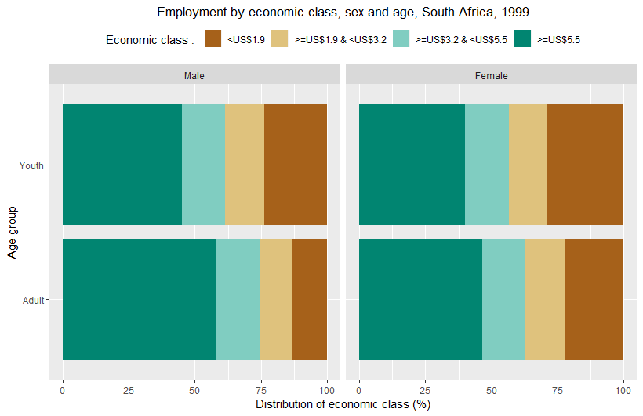

The ilostat R package in a few words
===========

This R package provides tools to access, download and work with the data contained in [ILOSTAT](https://www.ilo.org/ilostat), the ILO Department of Statistics' online database. 
ILOSTAT's data and related metadata are also directly available through ILOSTAT's website.

For more information on ILOSTAT's R package, including contact details and source code, refer to its [github page](https://github.com/ilostat/Rilostat).


# Introduction

The [ILO](https://www.ilo.org)'s main online database, [ILOSTAT](https://www.ilo.org/ilostat), maintained by the [Department of Statistics](https://www.ilo.org/stats), 
is the world's largest repository of labour market statistics. It covers all countries and regions and a wide range of labour-related topics, including employment, unemployment, 
wages, working time and labour productivity, to name a few. It includes time series going back as far as 1938; annual, quarterly and monthly labour statistics; country-level, 
regional and global estimates; and even projections of the main labour market indicators.

ILOSTAT's website provides immediate access to all its data and related metadata through different ways. Basic users can simply view the desired data online or download it in Excel or csv formats. 
More advanced users can take advantage of ILOSTAT's well-structured [bulk download facility](http://www.ilo.org/ilostat/faces/oracle/webcenter/portalapp/pagehierarchy/Page30.jspx) ([user guide](https://www.ilo.org/ilostat-files/Documents/ILOSTAT_BulkDownload_Guidelines.pdf)), or the SDMX web service  ([user guide](http://www.ilo.org/ilostat/content/conn/ILOSTATContentServer/path/Contribution%20Folders/statistics/web_pages/static_pages/technical_page/ilostat_appl/SDMX_User_Guide.pdf)).

The ilostat R package (`'Rilostat'`) was designed to give data users the ability to access the ILOSTAT database, search for data, rearrange the information as needed, download it in the desired format, and 
make various data visualizations, all in a programmatic and replicable manner, with the possibility of quickly re-running the queries as required.

#### Main features of the ilostat R package

  - Provides access to all annual, quarterly, and monthly data available via the ILOSTAT [bulk download facility](http://www.ilo.org/ilostat/faces/oracle/webcenter/portalapp/pagehierarchy/Page30.jspx) ([user guide](https://www.ilo.org/ilostat-files/Documents/ILOSTAT_BulkDownload_Guidelines.pdf))
  
  - Allows to search for and download data and related metadata in English, French and Spanish
  
  - Gives the ability to return `POSIXct` dates for easy integration into plotting and time-series analysis techniques
  
  - Returns data in long format for direct integration with packages like `ggplot2` and `dplyr`
  
  - Gives immediate access to the most recent updates
  
  - Allows for `grep`-style searching for data descriptions and names
  
  - Provides access to the ILOSTAT catalogue of related descriptive metadata ([user guide](https://www.ilo.org/ilostat-files/Documents/SDMX_User_Guide.pdf))


#### Acknowledgements

The developer of this package drew extensive inspiration from the [eurostat R package](https://cran.r-project.org/web/packages/eurostat) and its related documentation:

  - [Retrieval and Analysis of Eurostat Open Data with the eurostat Package](https://journal.r-project.org/archive/2017/RJ-2017-019/RJ-2017-019.pdf) - [Leo Lahti](https://github.com/antagomir), [Przemyslaw Biecek](https://github.com/pbiecek), [Markus Kainu](https://github.com/muuankarski) and [Janne Huovari](https://github.com/jhuovari). R Journal 9(1), 385-392, 2017.

# Installation

To install the release version, use the following command:

```{r,echo = FALSE, results = 'hide',   eval=TRUE, message = FALSE}
if(!require(devtools)){install.packages('devtools', repos='http://cran.us.r-project.org')}
if(!require(plotly)){install.packages('plotly', repos='http://cran.us.r-project.org')}
if(!require(dplyr)){install.packages('dplyr', repos='http://cran.us.r-project.org')}
if(!require(ggplot2)){install.packages('ggplot2', repos='http://cran.us.r-project.org')}
if(!require(plotrix)){install.packages('plotrix', repos='http://cran.us.r-project.org')}
if(!require(stringr)){install.packages('stringr', repos='http://cran.us.r-project.org')}
require(Rilostat)

```


```{r, eval=FALSE}
install.packages("Rilostat")
```


To install the development version, use the following command:

```{r, eval=FALSE}
if(!require(devtools)){install.packages('devtools')}
install_github("ilostat/Rilostat")
```

The ilostat R package (`'Rilostat'`) includes the following functions:

```{r, eval=TRUE}
require(Rilostat)
as.data.frame(ls("package:Rilostat"))

```

```{r, echo=FALSE, eval=TRUE}
options(ilostat_quiet = TRUE)
```

We do not expect to update the ilostat R package too often, but based on questions and remarks from ILOSTAT data users, we will progressively create more examples, 
tutorials, demos and apps. Please visite the [Rilostat package website](https://ilostat.github.io/Rilostat/).


# Search for data

Unless you already know the code of the indicator or the ref_area (reference area - countries or regions) that you want to download, the first step would be 
to search for the data you are interested in. `get_ilostat_toc()` provides grep style searching of all available indicators from ILOSTAT's bulk download 
facility and returns the indicators matching your query. `get_ilostat_toc(segment = 'ref_area')` returns the datasets available by ref_area ('country' and 'region').

To access the table of contents of all available indicators in ILOSTAT (by indicator):

```{r, eval=TRUE}
toc <- get_ilostat_toc()

```

<BR>

```{r, echo=FALSE, eval=TRUE, results = 'asis'}
knitr::kable(head(toc[1:3,1:5]), caption = "Table 1a. Extract, 'Table of contents by indicator in English'")
```

<BR>

All settings are available in the 3 official languages of the ILO: English (`'en'`), French (`'fr'`) and Spanish (`'es'`). The default is `'en'`.

For instance, to access the table of contents of all available datasets by reference area in ILOSTAT in Spanish:

<BR>

```{r, eval=TRUE}
toc <- get_ilostat_toc(segment = 'ref_area', lang = 'es')
```

<BR>

```{r, echo=FALSE, eval=TRUE}
knitr::kable(head(toc[1:3,1:9]),caption = "Table 1b. Extract, 'Table of contents by ref_area in Spanish'")
```

You can search for words or expressions within the table of contents listing all of ILOSTAT's indicators.

For example, searching for the word "bargaining" will return the indicators containing that word somewhere in the indicator information:


```{r, eval=TRUE}
toc <- get_ilostat_toc(search = 'bargaining')
```

<BR>

```{r, echo=FALSE, eval=TRUE}
knitr::kable(toc[,1:8],caption = "Table 1c. 'Table of contents by indicator with search word 'bargaining''")
```

Similarly, you can also search the list of all available datasets by reference area for a given reference area (using a country or region 
name or code) or even for a given data frequency (annual, quarterly or monthly). The search also allows you to look for several alternative 
and/or additional items at once.

For instance, to look for datasets with annual data for either Albania or France:

```{r, eval=TRUE}
toc <- get_ilostat_toc(segment = 'ref_area', search = c('France|Albania', 'Annual'), 
											fixed = FALSE)
```

<BR>

```{r, echo=FALSE, eval=TRUE}
knitr::kable(toc[1:2,1:9],caption = "Table 1d. 'Table of contents by ref_area with search words 'France' or 'Albania' and 'Annual''")
```

You can also manipulate ILOSTAT's table of contents' dataframe using the basic R filter. If you are already familiar with ILOSTAT data 
and the way it is structured, you can easily filter what you want.

For example, if you know beforehand you want data only from ILOSTAT's Short Term Indicators dataset (code "STI") and you are only 
interested in monthly data (code "M") you can simply do:

```{r, eval=TRUE}
toc <-  dplyr::filter(get_ilostat_toc(), collection == 'STI', freq == 'M')
```

<BR>

```{r, echo=FALSE, eval=TRUE}
knitr::kable(head(toc[1:5,1:5]),caption = "Table 1e. Extract, 'Table of contents by indicator filtered for Monthly Short term indicators'")
```


# Download data 

The function `get_ilostat()` explores ILOSTAT's datasets and returns datasets by indicator (default, segment `indicator`) or by reference 
area (segment `ref_area`). The id of each dataset is made up by the code of the segment chosen (indicator code or reference area code) and 
the code of the data frequency required (annual, quarterly or monthly), joined by an underscore.

#### Get a single dataset:

As stated above, you can easily access the single dataset of your choice through the `get_ilostat()` function, by indicating the 
code of the dataset desired (indicator_frequency or ref_area_frequency).


If you want to access annual data for indicator code UNE_2UNE_SEX_AGE_NB, you should type:

```{r, eval=TRUE}
dat <- get_ilostat(id = 'UNE_2UNE_SEX_AGE_NB_A', segment = 'indicator') 
```

<BR>

```{r, echo=FALSE, eval=TRUE}
knitr::kable(head(dat[1:3,2:8]),caption = "Table 2a. Extract, 'Annual unemployment by sex and age, ILO modelled estimates, Nov. 2018'")
```

If you want to access all annual data available in ILOSTAT for Armenia:

```{r, eval=TRUE}
dat <- get_ilostat(id = 'ARM_A', segment = 'ref_area') 

```

<BR>

```{r, echo=FALSE, eval=TRUE}
knitr::kable(head(dat[1:3, c(2:6,8:9)]),caption = "Table 2b. Extract, 'Armenia, annual data'")
```

<BR>

#### Get multiple datasets:

It is also possible to download multiple datasets at once, simply by setting the dataset's id as a vector of ids or a tibble that lists 
ids in a specific column:

```{r, eval=TRUE}
dat <- get_ilostat(id = c('AFG_A', 'TTO_A'), segment = 'ref_area') 

dplyr::count(dat, ref_area)

```

<BR>

```{r, eval=TRUE}
toc <- get_ilostat_toc(search = 'CPI_')

dat <- get_ilostat(id = toc, segment = 'indicator', quiet = TRUE) 

dplyr::count(dat, indicator)

```

# Time format

The function `get_ilostat()` will return time period information by default in a raw time format (`time_format = 'raw'`), which is a 
character vector with the following syntax:

  - Yearly data: `'YYYY'` where YYYY is the year.

  - Quarterly data: `'YYYYqQ'` where YYYY is the year and Q is the quarter (the number corresponding to the quarter from 1 to 4).

  - Monthly data: `'YYYYmMM'` where YYYY is the year and MM is the month (the number corresponding to the month from 01 to 12).

  To ease the use of data for plotting or time-series analysis techniques, the function can also return POSIXct dates 
  (using `time_format = 'date'`) or numeric dates (using `time_format = 'num'`).
  
  For instance, the following will return quarterly unemployment data by sex and age, with the time dimension in numeric format:

```{r, eval=TRUE}
dat <- get_ilostat(id = 'UNE_TUNE_SEX_AGE_NB_Q', time_format = 'num') 
```

<BR>

```{r, echo=FALSE, eval=TRUE}
knitr::kable(dat[1:3, 2:8],caption = "Table 3a. Extract, 'Quarterly unemployment by sex and age'")
```

The following will return monthly time-related underemployment data by sex and age, with the time dimension in POSIXct date format:

```{r, eval=TRUE}
dat <- get_ilostat(id = 'TRU_TTRU_SEX_AGE_NB_M', time_format = 'date') 
```

<BR>

```{r, echo=FALSE, eval=TRUE}
knitr::kable(head(dat[1:3, 2:8]),caption = "Table 3b. Extract, Monthly time-related underemployment by sex and age")
```

# Cached data

The function `get_ilostat()` stores cached data by default at `file.path(tempdir(), "ilostat")` in `rds` binary format.

However, via the `cache_dir` arguments, it is also possible to choose a different work directory to store data in, and via the `cache_format` 
arguments you can save it in other formats, such as `csv`, `dta`, `sav`, and `sas7bdat`.


```{r,eval=FALSE}
dat <- get_ilostat(id = 'TRU_TTRU_SEX_AGE_NB_M', cache_dir = 'c:/temp', cache_format = 'dta') 
```

These arguments can also be set using `options(ilostat_cache_dir = 'C:/temp')` and `options(ilostat_cache_format = 'dta')`.

The name of the cache file is built using `paste0(segment, "-", id, "-", type,"-",time_format, "-", last_toc_update ,paste0(".", cache_format))`, 
with 'last_toc_update' being the latest update of the dataset from the table of contents.

With the argument `back = FALSE`, datasets are downloaded and cached without being returned in R. This quiet setting is convenient particularly 
when downloading large amounts of data or datasets.


```{r, eval=FALSE}
get_ilostat(id = get_ilostat_toc(search = 'SDG'), 	cache_dir = 'c:/temp', cache_format = 'dta', 
													back = FALSE) 
```

# Filter data

Once you have retrieved and/or cached the dataset(s) you need, advanced `filters` can help you refine your data selection and facilitate reproducible 
analysis. You can apply several different filters to your datasets, to filter the data by reference area, sex, classification item, etc.


```{r, eval=FALSE}
options(ilostat_cache_dir = 'C:/temp')
dat <- get_ilostat(id = 'UNE_2EAP_SEX_AGE_RT_A', filters = list(
													ref_area = c('BRA', 'ZAF'), 
													sex = 'T', 
													classif1 = 'AGE_YTHADULT_Y15-24'))
dplyr::count(dat, ref_area, sex, classif1)
```

```{r, echo =FALSE, eval=TRUE}
# options(ilostat_cache_dir = 'C:/temp')
dat <- get_ilostat(id = 'UNE_2EAP_SEX_AGE_RT_A', filters = list(
													ref_area = c('BRA', 'ZAF'), 
													sex = 'T', 
													classif1 = 'AGE_YTHADULT_Y15-24'))
dplyr::count(dat, ref_area, sex, classif1)
```

<BR>

The argument `detail` set a default filter of aggregation. For instance, `detail = 'serieskeysonly'` will return distinct combinations 
of collection/ref_area/source/indicator/sex/classif1/classif2, whereas `detail = 'dataonly'` will remove the columns 
obs_status/note_classif/note_indicator/note_source from the dataset and `detail = 'serieskeysonly'` will select the best source 
(based on the lowest source sort id) at the collection/ref_area/./indicator/sex/classif1/classif2/time levels.

```{r, echo =FALSE, eval=TRUE}
# options(ilostat_cache_dir = 'C:/temp')
dat <- get_ilostat(id = 'UNE_2EAP_SEX_AGE_RT_A', filters = list(
													ref_area = c('BRA', 'ZAF'), 
													sex = 'M', 
													classif1 = 'AGE_YTHADULT_Y15'), 
												detail = 'serieskeysonly')
```

<BR>

```{r, eval=FALSE}
options(ilostat_cache_dir = 'C:/temp')
dat <- get_ilostat(id = 'UNE_2EAP_SEX_AGE_RT_A', filters = list(
													ref_area = c('BRA', 'ZAF'), 
													sex = 'M', 
													classif1 = 'AGE_YTHADULT_Y15'), 
												detail = 'serieskeysonly')
```

<BR>

```{r, echo=FALSE, eval=TRUE}
knitr::kable(head(dat[1:2,]),caption = "Table 4a. Extract, Youth male unemployment rate in Brazil and South Africa (ILO modelled estimates, Nov. 2018), 'Series Key'")
```

<BR>

```{r, echo =FALSE, eval=TRUE}
# options(ilostat_cache_dir = 'C:/temp')
dat <- get_ilostat(id = 'UNE_2EAP_SEX_AGE_RT_A', filters = list(ref_area = c('BRA', 'ZAF'), 
													sex = 'F', 
													classif1 = 'AGE_YTHADULT_Y15'), 
													detail = 'dataonly')
```
```{r, eval=FALSE}
# options(ilostat_cache_dir = 'C:/temp')
dat <- get_ilostat(id = 'UNE_2EAP_SEX_AGE_RT_A', filters = list(
													ref_area = c('BRA', 'ZAF'), 
													sex = 'F', 
													classif1 = 'AGE_YTHADULT_Y15'), 
												detail = 'dataonly')
```

<BR>

```{r, echo=FALSE, eval=TRUE}
knitr::kable(head(dat[1:3,2:8]),caption = "Table 4b. Extract, Youth female unemployment rate in Brazil and South Africa (ILO modelled estimates, Nov. 2018)")
```

In order to delete files from the cache just run:

```{r, eval=TRUE}
clean_ilostat_cache()

```

# Plot data

> Now that you found the datasets you needed and filtered them to have the desired data, you can start manipulating ILOSTAT data in a reproducible manner, 
and even use your other favourite R packages to make some great data visualizations.  

For example, you can use `ggplot2` and `dplyr` to visually compare trends in male labour force participation rate in Germany, 
France and the United States, since 2005 (see below). This lineal graph allows us to see that the male labour force participation rate is 
considerably higher in the United States than in Germany and France, but it has been decreasing at a steady pace since around 2008, closing the gap 
in participation rates particularly with Germany, where the male labour force participation rate slightly increased in the last period observed.


```{r, eval=FALSE}
require(Rilostat)
require(ggplot2, quiet = TRUE)
require(dplyr, quiet = TRUE)

  get_ilostat(id = 'EAP_DWAM_NOC_RT_A', 
              time_format = 'num', 
              filters = list( ref_area = c('FRA', 'USA', 'DEU'), 
                              timefrom = 2005, timeto = 2017))  %>% 
  select(ref_area, time, obs_value) %>% 
  ggplot(aes(x = time, y = obs_value, colour = ref_area)) + 
  geom_line() + 
  ggtitle('Male labour force participation rate in selected countries, 2005-2017') + 
  scale_x_continuous(breaks = seq(2005, 2017, 3)) +
  labs(x="Year", y="Male LFPR (%)", colour="Country:") +  
  theme(legend.position = "top", plot.title = element_text(hjust = 0.5))


```

<BR>

```{r, echo=FALSE, out.width = "100%"}
knitr::include_graphics("./g1_ts.png")
```
<BR>
<BR>

> You can also build interesting (and visually telling) stacked columns or bars.  

For example, based on ILOSTAT data, you can plot the distribution of employed persons by economic class (defined according to the household's 
per capita income/consumption per day). You can even do it with several disaggregations: in the example below, we chose to show the employment distribution by 
economic class separately for men and women and for youth and adults. From this figure, we clearly understand that working poverty (being poor in 
spite of being employed) affects youth much more than adults, and women more than men.

```{r, eval=FALSE}
require(Rilostat)
if(!require(ggplot2)){install.packages('ggplot2')}
if(!require(dplyr)){install.packages('dplyr')}

    get_ilostat(id = 'EMP_2EMP_SEX_AGE_CLA_DT_A', 
                filters = list( ref_area = 'ZAF', 
                                time = '1999', 
                                sex = c('M', 'F'), 
                                classif1 = c('Y15-24', 'YGE25'))) %>% 
    filter(!classif2 %in% 'CLA_ECOCLA_TOTAL') %>% 
    mutate(	sex = 		factor(sex) %>% recode_factor(
                                'SEX_M' = 'Male', 
                                'SEX_F' = 'Female'), 
			classif1 =  factor(classif1) %>% recode_factor(
                                'AGE_YTHADULT_YGE25' = 'Adult', 
                                'AGE_YTHADULT_Y15-24' = 'Youth'),
			classif2 =  factor(classif2) %>% recode_factor(
                                'CLA_ECOCLA_USDLT2' = '<US$1.9', 
                                'CLA_ECOCLA_USDGE2LT3' = '>=US$1.9 & <US$3.2', 
                                'CLA_ECOCLA_USDGE3LT5' = '>=US$3.2 & <US$5.5', 
                                'CLA_ECOCLA_USDGE5' = '>=US$5.5')) %>% 
    ggplot(aes(y=obs_value, x=as.factor(classif1), fill=classif2)) +
    geom_bar(stat="identity") +
    facet_wrap(~as.factor(sex)) + coord_flip() +
    theme(legend.position="top") +
    ggtitle("Employment by economic class, sex and age, South Africa, 1999") +
    labs(x="Age group", y="Distribution of economic class (%)", fill="Economic class : ") + 
	theme(plot.title = element_text(hjust = 0.5)) + 
    scale_fill_brewer(type = "div")
	
```

<BR>
```{r, echo=FALSE, out.width = "100%"}

```

<BR>
<BR>

> You can also combine the ilostat package with other packages to create triangular graphs, plotting three different indicators which relate to the same topic and whose observations are mutually exclusive.  

You can use this type of graph, for instance, to visually convey the share of the employed population working in agriculture, industry and services, all three compared, and even more revealing, compare this across countries.  

In the example below, we used three different indicators of labour underutilization (unemployment, time-related underemployment and discouraged job-seekers) to study how they are inter-related in  selected countries. These three population groups are all mutually exclusive, but they are all part of the broad category of labour underutilization. Unemployment represents all persons not in employment, available for employment and actively seeking employment, while discouraged job-seekers are those persons not in employment and available for employment who do not actively look for employment for specific reasons having to do with the situation in the labour market, and time-related underemployment refers to persons in employment who would like to work more hours and are available to work more hours than their current working time. The graph below brings to light the differences across countries in the labour underutilization composition, by showing where unemployment is the biggest concern, as opposed to time-related underemployment or discouragement. 

```{r, eval=FALSE}
require(Rilostat)
if(!require(tidyr)){install.packages('tidyr')}
if(!require(dplyr)){install.packages('dplyr')}
if(!require(plotrix)){install.packages('plotrix')}
if(!require(stringr)){install.packages('stringr')}

triangle <- get_ilostat(id = c('EIP_WDIS_SEX_AGE_NB_A', 
                               'UNE_TUNE_SEX_AGE_NB_A', 
                               'TRU_TTRU_SEX_AGE_NB_A'), 
                        filters = list(
                                      ref_area = c('ZAF', 'MNG', 'CHL'), 
                                      source = 'BA',
                                      sex = 'SEX_T', 
                                      classif1 = 'YGE15', 
                                      time = '2013'),
                              detail = 'dataonly', 
                              cmd = "dat %>% select(ref_area, indicator, obs_value)", 
                              quiet = TRUE) %>%
            label_ilostat() %>%
            group_by(ref_area.label) %>%
            mutate(obs_value = obs_value / sum(obs_value)) %>% ungroup() %>%
            mutate(indicator.label = indicator.label %>% 
                                      str_replace(fixed(' by sex and age (thousands)'), '')) %>%
            spread(indicator.label, obs_value)

par(cex=0.75, mar=c(0,0,0,0))
positions <- plotrix::triax.plot(
                      as.matrix(triangle[, c(2,3,4)]),
                      show.grid = TRUE,
                      main = 'Selected labour underutilization indicators',
                      label.points= FALSE, point.labels = triangle$ref_area.label,
                      col.axis="gray50", col.grid="gray90",
                      pch = 19, cex.axis=1.2, cex.ticks=0.7, col="grey50")
                     
                     
ind <- which(triangle$ref_area.label %in%  triangle$ref_area.label)

df <- data.frame(positions$xypos, geo =  triangle$ref_area.label)

points(df$x[ind], df$y[ind], cex=2, col="red", pch=19)

text(df$x[ind], df$y[ind], df$geo[ind], adj = c(0.5,-1), cex=1.5) 

```

<BR>
```{r, echo=FALSE, out.width = "100%"}
knitr::include_graphics("./g1_tri.png")
```

<BR>
<BR>

> It is also possible to create maps showing how indicators behave across the world at a given point in time (static maps) or even through time (dynamic maps allowing the user to scroll over the available time period).  

For instance, below we have built a map to see differences across the world in the youth unemployment rate. For this, we have selected data from a compilation which is methodologically robust and consistent across countries to ensure international comparability: the ILO modelled estimates (from November 2017). You can change the legend settings to use the color coding that best suits your data. In our case, the colour scale used allows us to quickly see that youth unemployment rates are particularly high in Southern and Northern Africa.

```{r, eval=FALSE}
require(Rilostat)
if(!require(plotly)){install.packages('plotly')}
if(!require(dplyr)){install.packages('dplyr')}
if(!require(stringr)){install.packages('stringr')}

dat <- get_ilostat(id = 'UNE_2YAP_NOC_RT_A', filters = list(time = '2017')) %>% 
			filter(!str_sub(ref_area,1,1) %in% 'X') %>% 
			select(ref_area, obs_value) %>% 
			left_join(	Rilostat:::ilostat_ref_area_mapping %>% 
							select(ref_area, ref_area_plotly)%>% 
							label_ilostat(code = 'ref_area'), 
						by = "ref_area") %>% 
			filter(!obs_value %in% NA)

	
			
dat %>% 
	plot_geo( 
			z = ~obs_value, 
			text = ~ref_area.label, 
			locations = ~ref_area_plotly
		) %>% 
		add_trace(
			colors = 'Blues',
			marker = list(
					    line = list(
							color = toRGB("grey"), 
							width = 0.5)
					), 
			showscale = TRUE
		) %>%
		colorbar(
			title = '%', 
			len = 0.5
		) %>%
		layout(
		  title = 'Youth unemployment rate in 2017 (ILO modelled estimates, Nov. 2018)', 
		  geo = list(	
					showframe = FALSE,  
					showcoastlines = TRUE, 
					projection = list(type = 'Mercator'), 
					showcountries = TRUE, 
					resolution = 110) # or 50
			) 
```

<BR>
```{r, echo=FALSE, out.width = "100%"}
knitr::include_graphics("./g1_map.png")
```

<BR>
<BR>


# Contact information

For further information on the `ilostat` R package, please contact:

- ILO Department of Statistics (`ilostat@ilo.org`)


For specific issues concerning code source, please report on [github](https://github.com/ilostat/Rilostat/issues)

For questions related to the ilostat database contact (`ilostat@ilo.org`) or visit [ilostat website](http://www.ilo.org/ilostat)


Permission to reproduce ILO publication and data: the reproduction of ILO material is generally authorized for non-commercial purposes and within established limits. 
However, you may need to submit a formal request in certain circumstances. for more information please refer to:


http://www.ilo.org/global/copyright 


http://www.ilo.org/global/copyright/request-for-permission

